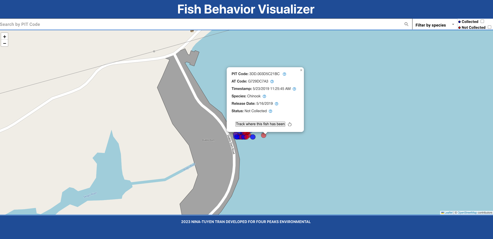

# Fish Behavior Visualizer 

The Fish Behavior Visualizer is a REACT-based app that allows you to fetch spatial and temporal fish data and visualize it on a map to study any behavioral trends between species of fish released in a reservoir. Some questions that this app aims to answer:
- Where have the fish been in the waterbody?
- What proportion of released fish were collected?
- Are there differences between the movement patterns of different species?

# Fish Behavior Visualizer 

The Fish Behavior Visualizer is a REACT-based app that allows you to fetch spatial and temporal fish data and visualize it on a map to study any behavioral trends between species of fish released in a reservoir. Some questions that this app aims to answer:
- Where have the fish been in the waterbody?
- What proportion of released fish were collected?
- Are there differences between the movement patterns of different species?

